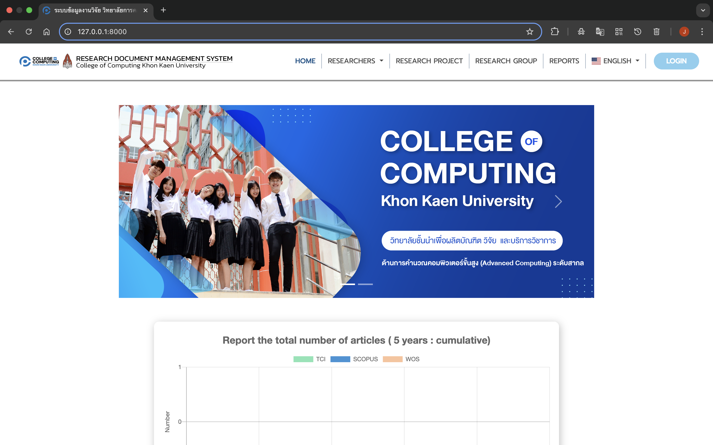
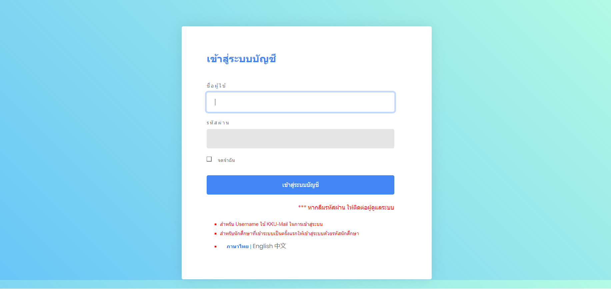
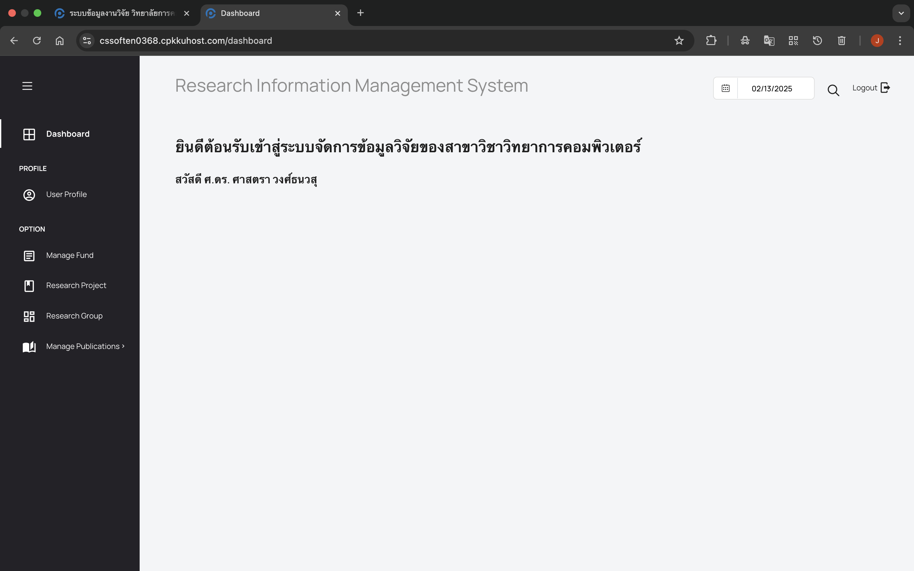
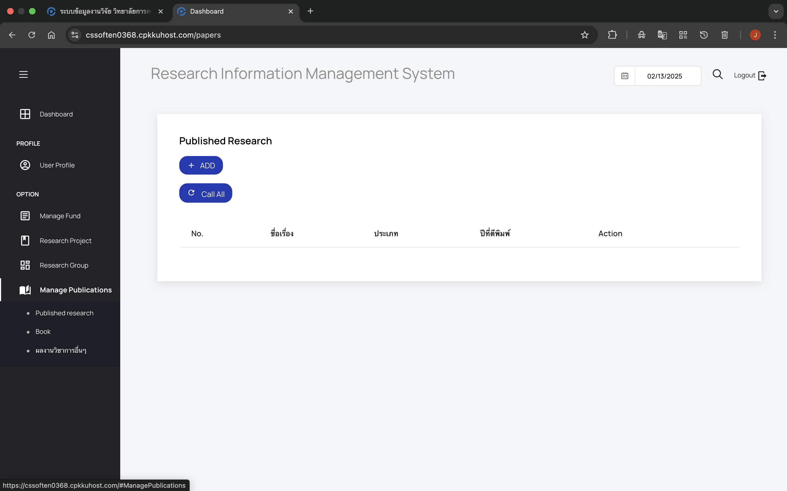
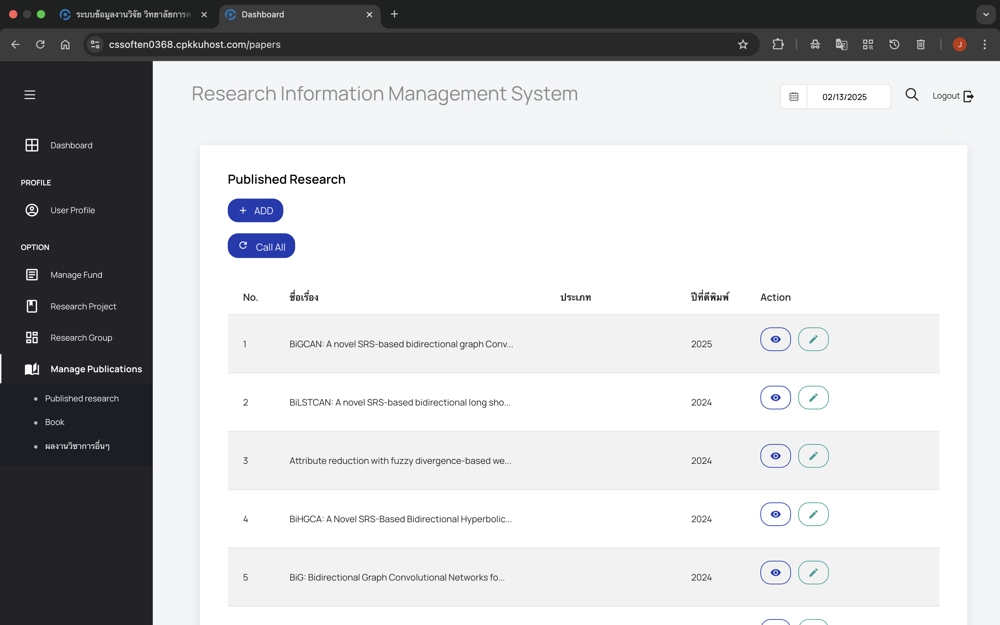
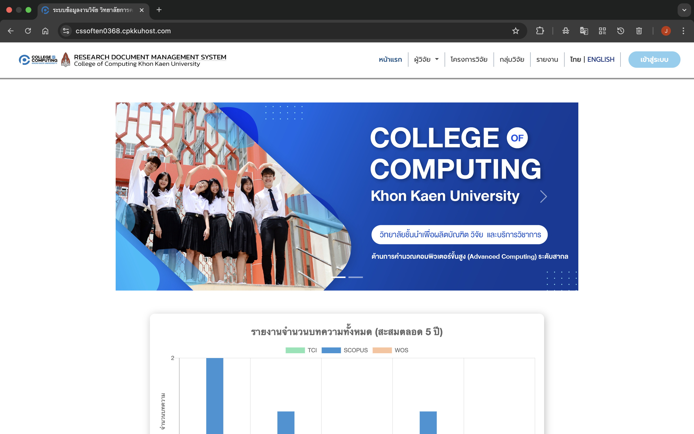

# คู่มือการใช้งานระบบ (User Manual)

## เริ่มต้นใช้งาน

### การเข้าสู่ระบบ (Login)

คลิกเมนู "LOGIN"

กรอกข้อมูลสำหรับเข้าสู่ระบบ
- **Username:** `Emailของผู้ใช้งาน`
- **Password:** `123456789`

กด "LOGIN" เพื่อเข้าถึงระบบ

---

### การใช้งานปุ่ม Callpaper. เพื่อที่จะโชว์งานวิจัยของผู้ใช้งาน

หน้าเริ่มต้น

กด Manage Publication เลือก Published sesearch

กด Callpaper

---

### การใช้งานปุ่มเปลี่ยนภาษา

กด "ไทย"

กด "English"

---
