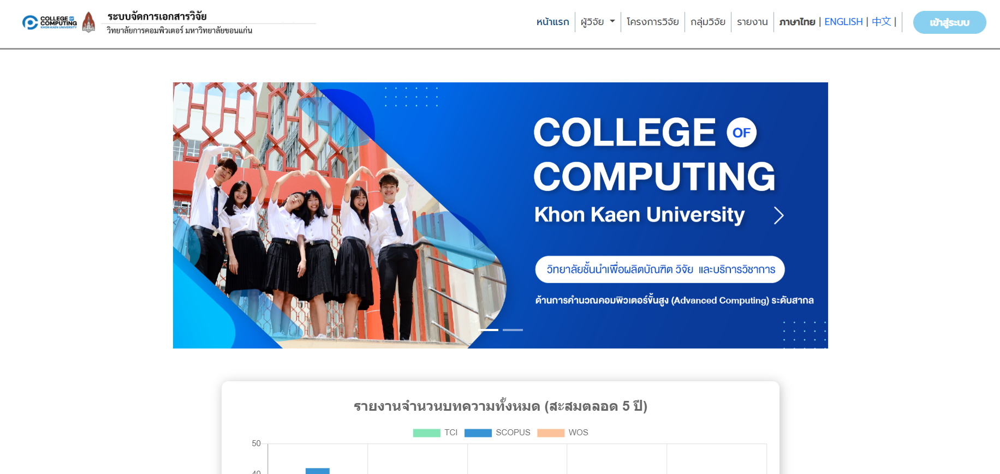
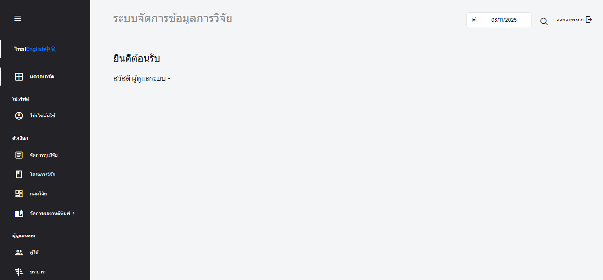

# คู่มือการใช้งานระบบ (User Manual)

### การเข้าสู่ระบบ (Login)

คลิกเมนู "LOGIN" 

รายละเอียดการเข้าระบบของผู้ใช้งานแต่ละกลุ่ม คือ
**อาจารย์/บุคลากร/นักศึกษา** ใช้ **KKU-Mail** เป็น **Username** เข้าสู่ระบบครั้งแรก **Password:** คือ `123456789` 
**นักศึกษาป.โท/ป.เอก** ที่เข้าใช้ระบบเป็นครั้งแรก ต้องใช้รหัสนักศึกษา ทั้ง **Username** และ **Password**
**เจ้าหน้าที่ (Staff)** ใช้บัญชีเฉพาะที่ได้รับจากผู้ดูแลระบบ
หากต้องการให้ระบบจำการเข้าสู่ระบบครั้งถัดไป ให้คลิกที่ **"Remember Me"** 

กดปุ่ม "LOGIN" เพื่อเข้าถึงระบบ

---

### สำหรับผู้ใช้งานทั่วไป

หน้าแรก (HOME)
เป็นหน้าแรกของ Research Document Management System ที่ออกแบบมาเพื่อให้ข้อมูลเกี่ยวกับนักวิจัย โครงการวิจัย
และรายงานผลงานวิจัยของ Collegeof Computing, Khon Kaen University

1. เมนูหลัก (Navigation Bar)
    - Home : กลับมาที่หน้าแรก
    - Researchers : รายชื่อนักวิจัย โดยมีเมนูย่อย ได้แก่ Computer Science, Infomation Technology, Geo-Informatics
    - Research Project : รายละเอียดโครงการวิจัย
    - Research Group : กลุ่มวิจัยต่าง ๆ ในคณะ
    - Reports : รายงานวิจัย
    - Language Switch (English | ไทย | 中文) : เปลี่ยนภาษาของเว็บไซต์
    - Login : เข้าสู่ระบบสำหรับผู้ใช้ที่มีบัญชี

2. แบนเนอร์ (Banner)
    - แสดงรายละเอียดโครงงานที่โดดเด่น
    - แสดงแนะนำทีมผู้บริหารของคณะ

2. กราฟแสดงจำนวนงานวิจัย
    แสดงกราฟ สรุปจำนวนบทความวิจัยที่ตีพิมพ์ในช่วง 5 ปีที่ผ่านมา โดยแบ่งเป็น 3 ประเภท:
    - SCOPUS (แสดงเป็นแท่งสีน้ำเงิน)
    - WOS (แสดงเป็นแท่งสีส้ม)
    - TCI (แสดงเป็นแท่งสีเขียว)   

    ด้านล่างมี สรุปจำนวนบทความทั้งหมด:
    Summary - จำนวนบทความทั้งหมด
    - SCOPUS : จำนวนบทความที่ตีพิมพ์ในฐานข้อมูล SCOPUS
    - WOS : จำนวนบทความที่ตีพิมพ์ในฐานข้อมูล Web of Science (WOS)
    - TCI : จำนวนบทความที่ตีพิมพ์ในฐานข้อมูล TCI (Thai Citation Index)

    การใช้งาน:
        เมื่อเลื่อนเมาส์ไปที่แท่งกราฟ จะแสดงตัวเลขของแต่ละปี

3. รายการปีที่มีงานวิจัย
   แสดงรายการตีพิมพ์วิจัยที่แบ่งตามปี ได้แก่: (2025, 2024, 2023, 2022, 2021, 2020, ก่อนปี 2019)
   การใช้งาน:
        - คลิกที่แต่ละปีเพื่อขยาย/ซ่อน รายละเอียดบทความวิจัยที่ตีพิมพ์ในปีนั้น
        - คลิกที่งานวิจัยเพื่อดูรายละเอียดเพิ่มเติม

4. การใช้งานเมนูหลัก
    4.1 Language Switch การใช้งานปุ่มเปลี่ยนภาษา
        สามารถเปลี่ยนภาษาของเว็บไซต์ได้โดยคลิกที่ตัวเลือก English | ไทย | 中文 ที่มุมขวาบนของหน้า
        กด "ไทย"
        

        กด "English"
        

        กด "Chinese"
        

    4.2 Researchers
        
    4.3 Research Project
    4.4 Research Group
    4.5 Reports
    4.6 

---
### สำหรับอาจารย์และเจ้าหน้าที่
เมื่ออาจารย์และเจ้าหน้าที่เข้าสู่ระบบจะเข้าถึงหน้าเมนู Staff Dashboard ได้

การใช้งานปุ่ม Callpaper. เพื่อที่จะโชว์งานวิจัยของผู้ใช้งาน

หน้าเริ่มต้น

กด Manage Publication เลือก Published sesearch

กด Callpaper

---
**คำถามที่พบบ่อย (FAQ)**
Q: ไม่สามารถเข้าสู่ระบบได้ ต้องทำอย่างไร?
A: หากยังเข้าสู่ระบบไม่ได้ เช่น ลืมรหัสผ่าน ให้ติดต่อผู้ดูแลระบบ

Q: การตีพิมพ์ที่แสดงในกราฟมาจากแหล่งข้อมูลใด?
A: ข้อมูลบทความวิจัยที่แสดงมาจากฐานข้อมูล SCOPUS, WOS และ TCI

Q: การตีพิมพ์ที่แสดงในกราฟมาจากแหล่งข้อมูลใด?
A: ข้อมูลบทความวิจัยที่แสดงมาจากฐานข้อมูล SCOPUS, WOS และ TCI